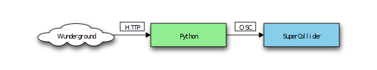

# AmbientWeather
Author(s): Karishma Changlani, Peter Gagliardi

Ambient music that reacts to the current weather

## Installation

### Dependencies
* Python 3.4+ 
* Wunderground API key
* pip packages:
    * requests, 
    * python-osc, 

### Setup
* Make a file called key.txt which has your winderground API key as it 
  is on the first line. (sample file inlcuded and sample_key) 
* Open SuperCollider and open `ambient_weather.scd` and run all the code blocks. 
  This initializes the synthesizer and prepares the server to receive OSC messages
* run main.py.

## About

AmbientWeather is a collection of SuperCollider synthesizers that are inspired
by the weather. Some are natural sounds like rain or crickets chirping. Others
are synth pads that play patterns of music that remind us of different temperature ranges.

### How it works

To play music, the python script fetches weather data from [wunderground.com](https://www.wunderground.com). 
It then extracts temperature, precipitation, weather condition, etc from the JSON data. These numbers are converted
to normalized numbers in the range of 0.0 to 1.0 which will eventually control SuperCollider synth settings. 
Normalized values were chosen to allow maximum flexibility and reusability in the SuperCollider code.

The Python script then sends OSC messages to supercollider with the normalized values. The SuperCollider code takes
the temperature and other values and adjusts synth settings (such as which music pattern to play or how heavy the rain is)

This process is repeated at least once a minute to continually react to the weather.

## Future Development

These are some features to add in the future:

* Right now, we select only one city at a time. Allow the user to toggle between
  multiple cities interactively
* Add more synths and musical patterns. It would be nice to have several layers of patterns
  playing at once